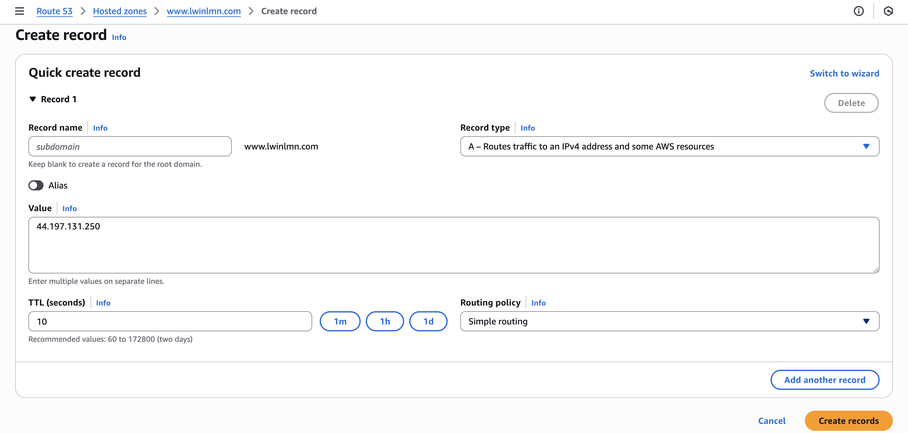
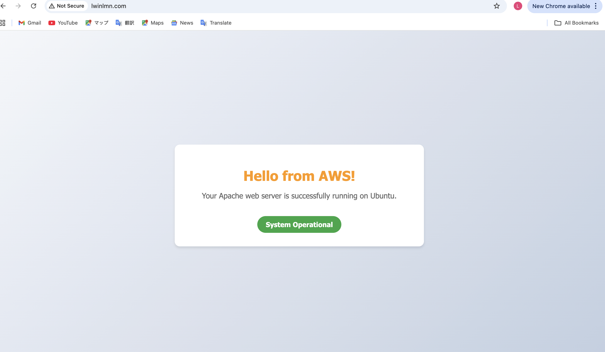
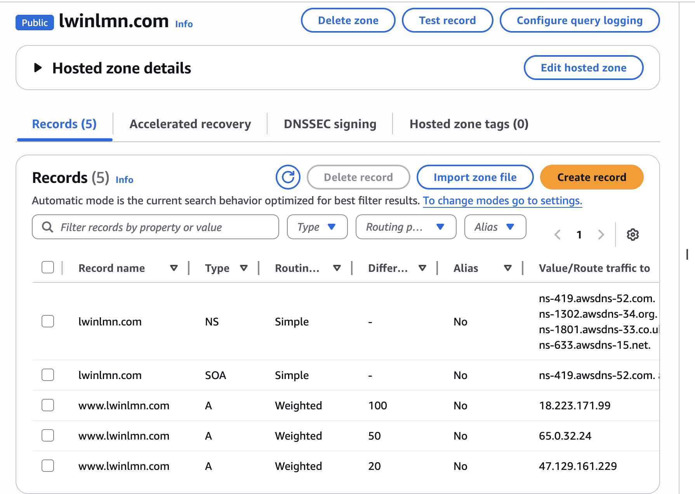
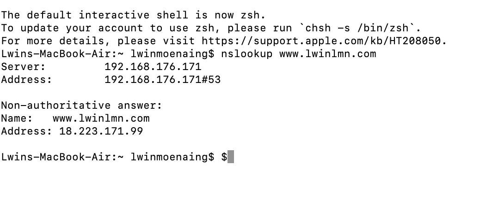

# AWS Route 53 - Global Traffic Management

A comprehensive deep dive into Amazon Route 53, implementing all 7 routing policies for high availability, disaster recovery, and performance optimization across multiple AWS Regions.

---

Architecture Design
*(This section will feature 3 distinct architecture diagrams covering Global Traffic Flow, Disaster Recovery, and Traffic Shaping.)*

### 1. Global Performance Architecture (Latency & Geo)
> *[Diagram Coming Soon - Logic for US, Mumbai, Singapore]*

### 2. Disaster Recovery Architecture (Failover)
> *[Diagram Coming Soon - Active-Passive Setup]*

### 3. Traffic Logic Flow (Weighted & IP-based)
> *[Diagram Coming Soon - Flowchart]*

---

## Routing Policies Implementation

### 1️⃣ Simple Routing Policy (The Foundation)
**Scenario:** Mapping the custom domain `www.lwinlmn.com` to a single EC2 Web Server.

Click here to view Configuration & Results

| Step | Description | Screenshot |
|---|---|---|
| **1. Setup** | Created Public Hosted Zone |  |
| **2. Config** | Pointed A Record to EC2 IP |  |
| **3. Result** | Successful Connection |  |

---

### 2️⃣ Weighted Routing Policy (Traffic Shaping)
Scenario: Implementing a Canary Deployment or A/B Testing by distributing traffic to different servers based on assigned weights (percentages). シナリオ: 特定の重み（パーセンテージ）に基づいてトラフィックを異なるサーバーに分散させ、カナリアリリースやA/Bテストを実装します。

Click here to view Configuration & Results / 設定と結果を表示するにはここをクリック

| Step / ステップ | Description / 説明 | Screenshot / スクリーンショット |
|:---:|---|:---:|
| **1. Config** | Assigned weights (100, 50, 20) to three different server IPs in the Route 53 console. / Route 53コンソールで、3つの異なるサーバーIPに重み（100, 50, 20）を割り当てました。 |  |
| **2. Result** | Verified via `nslookup` that the domain resolves to the IP with the highest weight (`18.223.171.99`). / `nslookup` を使用して、最も重い値（100）を持つIPアドレスにドメインが解決されることを確認しました。 |  |

---

### 3️⃣ Failover Routing Policy (Disaster Recovery)
**Scenario:** Automatic failover to a backup S3 site when the primary server fails health checks.
> *Implementation coming next week...*

---

### 4️⃣ Latency & Geolocation Routing
**Scenario:** Serving content from the nearest region (Mumbai/Singapore) and restricting content based on country.
> *Implementation coming next week...*

---

## 🛠️ Tech Stack
* **AWS Services:** Route 53, EC2, S3, VPC, CloudWatch (Health Checks)
* **Web Server:** Apache (HTTPD) on Ubuntu
* **Tools:** Draw.io (for Architecture Diagrams)
