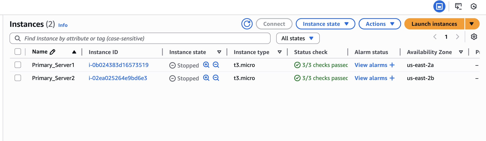
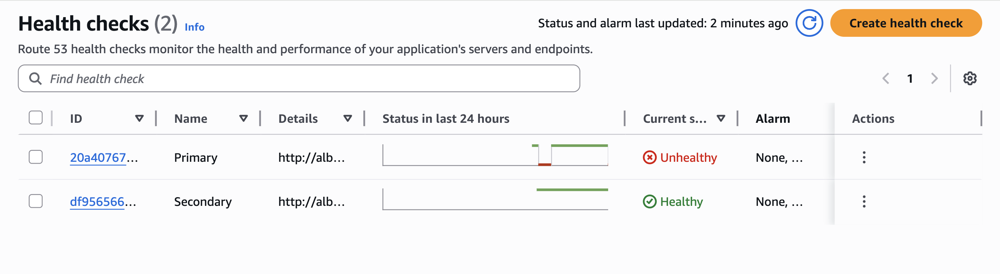
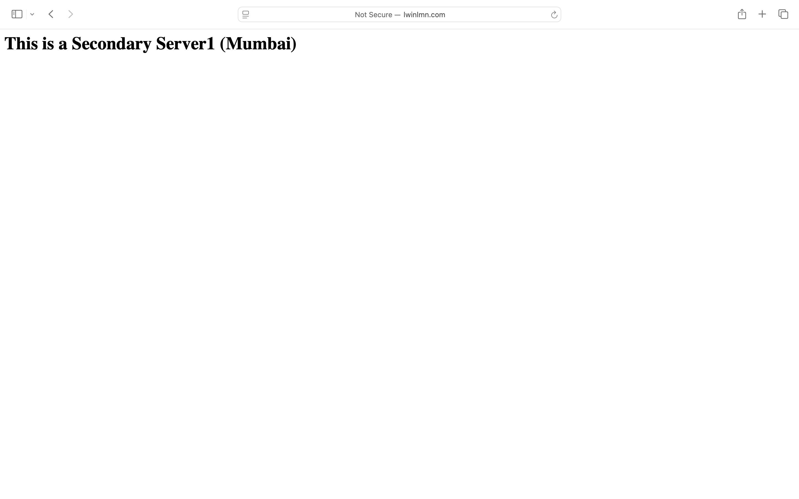
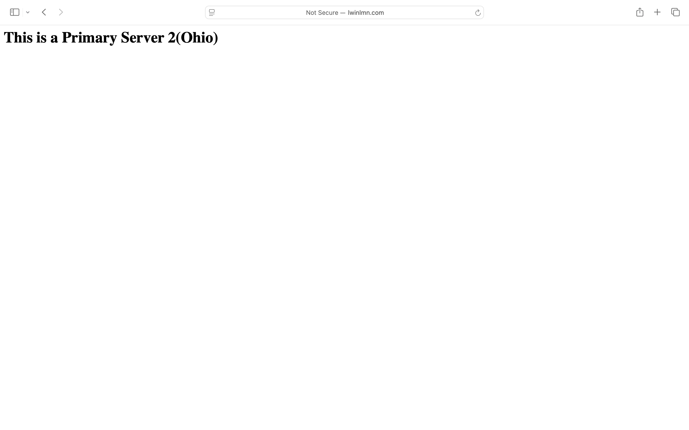
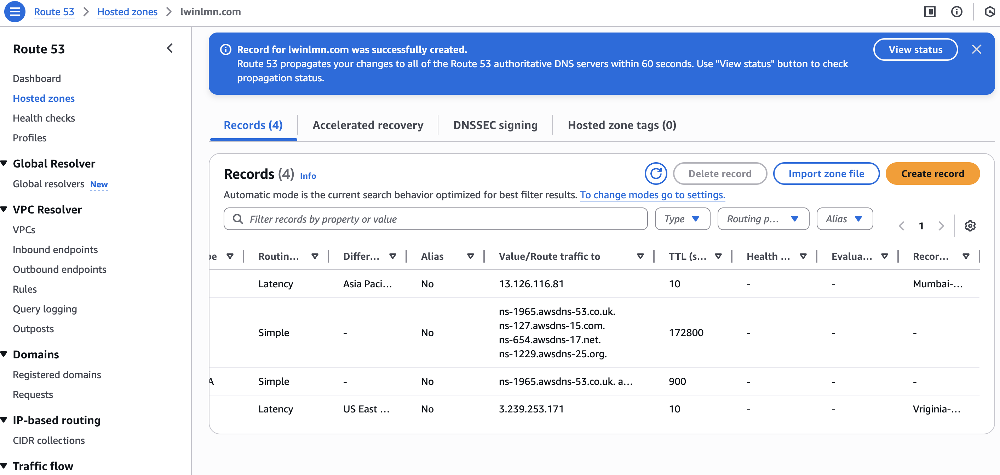
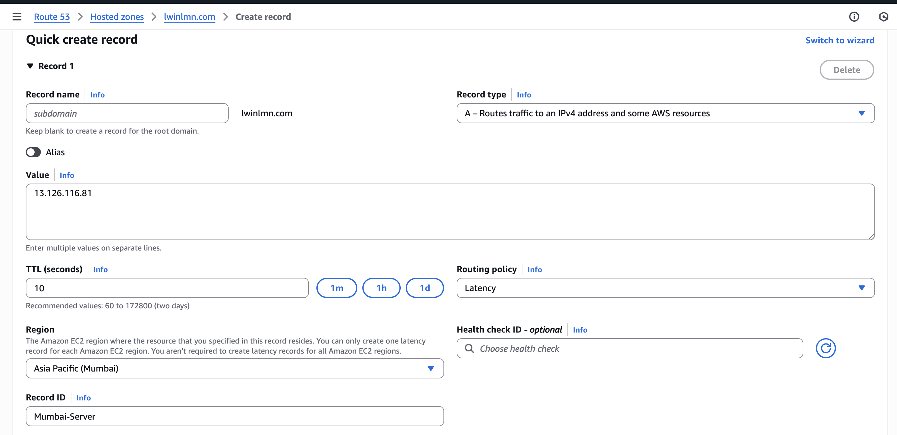
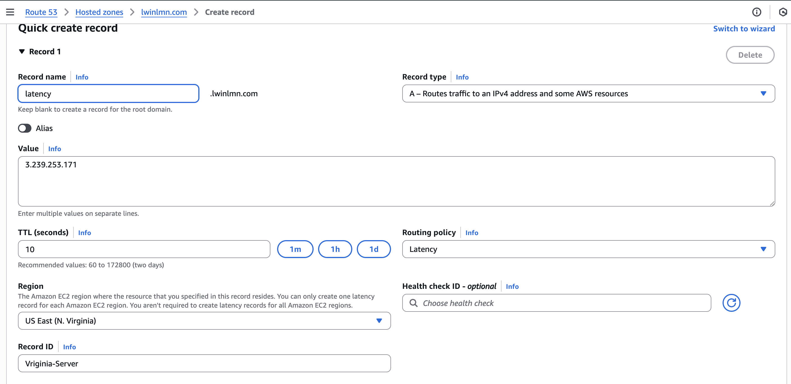

# AWS Route 53 - Global Traffic Management

A comprehensive deep dive into Amazon Route 53, implementing all 7 routing policies for high availability, disaster recovery, and performance optimization across multiple AWS Regions.

---

Architecture Design
*(This section will feature 3 distinct architecture diagrams covering Global Traffic Flow, Disaster Recovery, and Traffic Shaping.)*

### 1. Global Performance Architecture (Latency & Geo)
> *[Diagram Coming Soon - Logic for US, Mumbai, Singapore]*

### 2. Disaster Recovery Architecture (Failover)
> *[Diagram Coming Soon - Active-Passive Setup]*

### 3. Traffic Logic Flow (Weighted & IP-based)
> *[Diagram Coming Soon - Flowchart]*

---

## Routing Policies Implementation

### 1.Simple Routing Policy (The Foundation)
**Scenario:** Mapping the custom domain `www.lwinlmn.com` to a single EC2 Web Server.

Click here to view Configuration & Results

| Step | Description | Screenshot |
|---|---|---|
| **1. Setup** | Created Public Hosted Zone |  |
| **2. Config** | Pointed A Record to EC2 IP |  |
| **3. Result** | Successful Connection |  |

---

 ### 2.Weighted Routing Policy (Traffic Shaping)
Scenario: Implementing a Canary Deployment or A/B Testing by distributing traffic to different servers based on assigned weights (percentages).

シナリオ: 特定の重み（パーセンテージ）に基づいてトラフィックを異なるサーバーに分散させ、カナリアリリースやA/Bテストを実装します。

Click here to view Configuration & Results / 設定と結果を表示するにはここをクリック

| Step / ステップ | Description / 説明 | Screenshot / スクリーンショット |
|:---:|---|:---:|
| **1. Config** | Assigned weights (100, 50, 20) to three different server IPs in the Route 53 console. / Route 53コンソールで、3つの異なるサーバーIPに重み（100, 50, 20）を割り当てました。 |  |
| **2. Result** | Verified via `nslookup` that the domain resolves to the IP with the highest weight (`18.223.171.99`). / `nslookup` を使用して、最も重い値（100）を持つIPアドレスにドメインが解決されることを確認しました。 |  |

---

### 3.Failover Routing Policy (Disaster Recovery) / フェイルオーバールーティングポリシー

**Scenario:** Implementing an **Active-Passive Disaster Recovery** setup. Traffic is directed to the **Primary Server (Ohio)** while it is healthy. If the primary region fails, Route 53 automatically detects the failure and redirects users to the **Secondary Server (Mumbai)**.

**シナリオ:** **アクティブ/パッシブ構成のディザスタリカバリ**を実装します。通常、トラフィックは**メインサーバー（オハイオ）**に送られますが、メインリージョンに障害が発生した場合、Route 53が自動的に検知し、**バックアップサーバー（ムンバイ）**にリダイレクトします。

Click here to view Configuration & Results / 設定と結果を表示するにはここをクリック

| Step / ステップ | Description / 説明 | Screenshot / スクリーンショット |
|:---:|---|:---:|
| **1. Primary Setup** | Primary instances are running in the Ohio region. / オハイオリージョンでメインインスタンスが稼働中。 |  |
| **2. Health Check** | Monitoring the primary endpoint. Failure is detected when the server stops. / メインエンドポイントを監視。停止時に「Unhealthy（異常）」を検知。 |  |
| **3. Failover Action** | Traffic is automatically routed to the **Secondary Server in Mumbai**. / トラフィックが自動的に**ムンバイのバックアップサーバー**へ転送。 |  |
| **4. Recovery** | Once the primary server is restored, traffic returns to the **Primary Server in Ohio**. / メインサーバー復旧後、トラフィックは自動的に**オハイオ**に戻ります。 |  |

---

### 4️⃣ Latency Routing Policy / レイテンシーベースルーティングポリシー

**Scenario:** Optimizing global performance by directing traffic to the AWS region that provides the lowest network latency for the user.

**シナリオ:** ユーザーに対して最もネットワーク遅延（レイテンシー）が少ないAWSリージョンにトラフィックをルーティングし、グローバルなパフォーマンスを最適化します。

Click here to view Configuration & Results / 設定と結果を表示するにはここをクリック

| Step / ステップ | Description / 説明 | Screenshot / スクリーンショット |
|:---:|---|:---:|
| **1. Overview** | Configured Latency records for Mumbai and North Virginia in the Hosted Zone. / ホストゾーンでムンバイとバージニア北部用のレイテンシーレコードを設定しました。 | [ |
| **2. Mumbai Config** | Routing traffic to the Asia Pacific (Mumbai) region for users in Asia. / アジアのユーザー向けに、アジアパシフィック（ムンバイ）リージョンへトラフィックを誘導します。 | [ |
| **3. Virginia Config** | Routing traffic to the US East (N. Virginia) region for North American users. / 北米のユーザー向けに、米国東部（バージニア北部）リージョンへトラフィックを誘導します。 | [ |

---

## 🛠️ Tech Stack
* **AWS Services:** Route 53, EC2, S3, VPC, CloudWatch (Health Checks)
* **Web Server:** Apache (HTTPD) on Ubuntu
* **Tools:** Draw.io (for Architecture Diagrams)
